## 10. Memory Optimizations

### 10.1 Data Transfer Between Host and Device

The peak theoretical bandwidth between the device memory and the GPU is much higher than the peak theoretical bandwidth between host memory and device memory. **Hence, for best overall application performance, it is important to minimize data transfer between the host and the device, even if that means running kernels on the GPU that do not demonstrate any speedup compared with running them on the host CPU.**

> High Priority: Minimize data transfer between the host and the device, even if it means running some kernels on the device that do not show performance gains when compared with running them on the host CPU.

Also, because of the overhead associated with each transfer, **batching many small transfers into one larger transfer performs significantly better than making each transfer separately,** even if doing so requires packing non-contiguous regions of memory into a contiguous buffer and then unpacking after the transfer.

Finally, higher bandwidth between the host and the device is achieved when using page-locked (or pinned) memory.

#### 10.1.1 Pinned Memory

Pinned memory is allocated using the `cudaHostAlloc()` functions in the RuntimeAPI. For regions of system memory that have already been pre-allocated, `cudaHostRegister()` can be used to pin the memory on-the-fly without the need to allocate a separate buffer and copy the data into it.

Pinned memory should not be overused. Excessive use can reduce overall system performance because pinned memory is a scarce resource, but how much is too much is difficult to know in advance. Furthermore, the pinning of system memory is a heavyweight operation compared to most normal system memory allocations, so as with all optimizations, test the application and the systems it runs on for optimal performance parameters.

#### 10.1.2 Asynchronous and Overlapping Transfers with Computation

Data transfers between the host and the device using `cudaMemcpy()` are blocking tranfers; that is, control is returned to the host thread only after the data transfer is complete. The `cudaMemcpyAsync()` function is a non-blocking variant of `cudaMemcpy()` in which control is returned immediately to the host thread. The asynchronous transfer version requires pinned host memory, and it contains an additional argument, a stream ID. A stream is simply a sequence of operations that are performed in order on the device. **Operations in different streams can be interleaved and in some cases overlapped - a property that can be used to hide data transfers between the host and the device.**

On all CUDA-enabled devices, it is possible to overlap host computation with asynchronous data transfers and with device computations.

```C++
cudaMemcpyAsync(a_d, a_h, size, cudaMemcpyHostToDevice, 0);
kernel<<<grid, block>>>(a_d);
cpuFunction();
```

The last argument to the `cudaMemcpyAsync()` function is the stream ID, which in this case uses the default stream, stream 0. The kernel also uses the default stream, and it will not begin execution until the memory copy completes; therefore, no explicit synchronization is needed. Because the memory copy and the kernel both return control to the host immediately, the host function `cpuFunction()` overlaps their execution.

On devices that are capable of concurrent copy and compute, it is possible to overlap kernel execution on the device with data transfers between the host and the device. Whether a device has this capability is indicated by the `asyncEngineCount` field of the `cudaDeviceProp` structure. On devices that have this capability, the overlap once again requires pinned host memory, and, in addition, **the data transfer and kernel must use different, non-default streams** (streams with non-zero stream IDs). Non-default streams are required for this overlap because memory copy, memory set functions, and kernel calls that use the default stream begin only after all preceding calls on the device (in any stream) have completed, and no operation on the device (in any stream) commences until they are finished.

```C++
cudaStreamCreate(&stream1);
cudaStreamCreate(&stream2);
cudaMemcpyAsync(a_d, a_h, size, cudaMemcpyHostToDevice, stream1);
kernel<<<grid, block, 0, stream2>>>(otherData_d);
```

This technique could be used when the data dependency is such that the data can be broken into chunks and transferred in multiple stages, launching multiple kernels to operate on each chunk as it arrives.

```C++
// Staged concurrent copy and execute
size = N*sizeof(float) / nStreams;
for (int i = 0; i < nStreams; ++i) {
    offset = i*N / nStreams;
    cudaMemcpyAsync(a_d+offset, a_h+offset, size, cudaMemcpyDefault, stream[i]);
    kernel<<<N/(nThreads*nStreams), nThreads, 0, stream[i]>>>(a_d+offset);
}
```

GPUs with a single copy engine can perform one asynchronous data transfer and execute kernels whereas GPUs with two copy engines can simultaneously perform one asynchronous data transfer from the host to the device, one asynchronous data transfer from the device to the host, and execute kernels. (It should be mentioned that it is not possible to overlap a blocking transfer with an asynchronous transfer, because the blocking transfer occurs in the default stream, so it will not begin until all previous CUDA calls complete.)

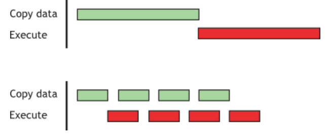

In such cases, and when the execution time (tE) exceeds the transfer time (tT), a rough estimate for the overall time is tE + tT/nStreams for the staged version versus tE + tT for the sequential version. If the transfer time exceeds the execution time, a rough estimate for the overall time is tT + tE/nStreams.

#### 10.1.3 Zero Copy

```C++
float *a_h, *a_map;
...
cudaGetDeviceProperties(&prop, 0);
if (!prop.canMapHostMemory)
    exit(0);
cudaSetDeviceFlags(cudaDeviceMapHost);
cudaHostAlloc(&a_h, nBytes, cudaHostAllocMapped);
cudaHostGetDevicePointer(&a_map, a_h, 0);
kernel<<<gridSize, blockSize>>>(a_map);
```

#### 10.1.4 Unified Virtual Addressing

With UVA, the host memory and the device memories of all installed supported devices share a single virtual address space. On the other hand, the physical memory space to which a pointer points can be determined simply by inspecting the value of the pointer using `cudaPointerGetAttributes()`.

> Under UVA, pinned host memory allocated with `cudaHostAlloc()` will have identical host and device pointers, so it is not necessary to call `cudaHostGetDevicePointer()` for such allocations. Host memory allocations pinned after-the-fact via `cudaHostRegister()`, however, will continue to have different device pointers than their host pointers, so `cudaHostGetDevicePointer()` remains necessary in that case.

### 10.2 Device Memory Spaces

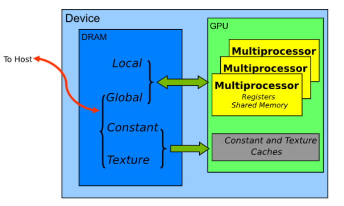

#### 10.2.1 Coalesced Access to Global Memory

> **High Priority: Ensure global memory accesses are coalesced whenever possible.**

On devices of compute capability 6.0 or higher, the concurrent accesses of the threads of a warp will coalesce into a number of transactions equal to the number of 32-byte transactions necessary to service all of the threads of the warp.

##### 10.2.1.1 A Simple Access Pattern

For example, if the threads of a warp access adjacent 4-byte words(e.g., adjacent `float` values), four coalesced 32-byte transactions will service that memory access.

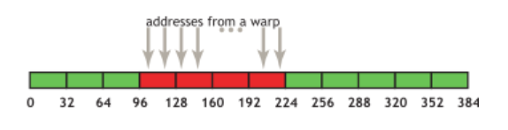

If from any of the four 32-byte segments only a subset of the words are requested (e.g. if several threads had accessed the same word or if some threads did not participate in the access), the full segment is fetched anyway. Furthermore, if accesses by the threads of the warp had been permuted within or accross the four segments, still only four 32-byte transactions would have been performed by a device with compute capability 6.0 or higher.

##### 10.2.1.2 A Sequential but Misaligned Access Pattern

If sequential threads in a warp access memory that is sequential but not aligned with a 32-byte segment, five 32-byte segments will be requested.

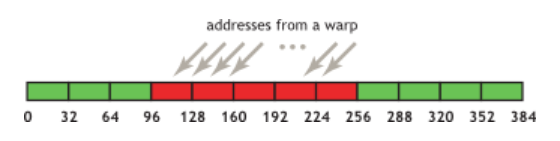

Memory allocated through the CUDA Runtime API, such as via `cudaMalloc()`, is guaranteed to be aligned to at least 256 bytes. Therefore, choosing sensible thread block sizes, such as multiples of the warp size, facilitates memory accesses by warps that are properly aligned. 

##### 10.2.1.3 Effects of Misaligned Accesses

```C++
__global__ void offsetCopy(float *odata, float *idata, int offset) {
    int xid = blockIdx.x * blockDim.x + threadIdx.x + offset;
    odata[xid] = idata[xid];
}
```

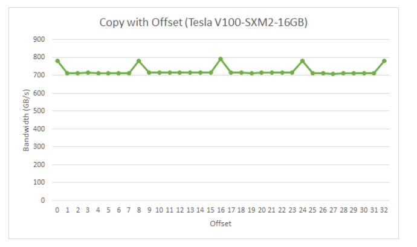

For the NVIDIA Tesla V100, global memory accesses with no offset or with offsets that are multiples of 8 words result in four 32-byte transactions. The achieved bandwidth is approximately 790 GB/s. Otherwise, five 32-byte segments are loaded per warp, and we would expect approximately 4/5th of the memory throughput achieved with no offsets.
>In this particular example, the offset memory throughput achieved is, however, approximately 9/10th, because adjacent warps reuse the cache lines their neighbors fetched. So while the impact is still evident it is not as large as we might have expected. It would have been more so if adjacent warps had not exhibited such a high degree of reuse of the over-fetched cache lines.

##### 10.2.1.4 Strided Accesses

```C++
__global__ void strideCopy(float *odata, float *idata, int stride) {
    int xid = (blockIdx.x*blockDim.x +  threadIdx.x) * stride
    odata[xid] = idata[xid];
}
```

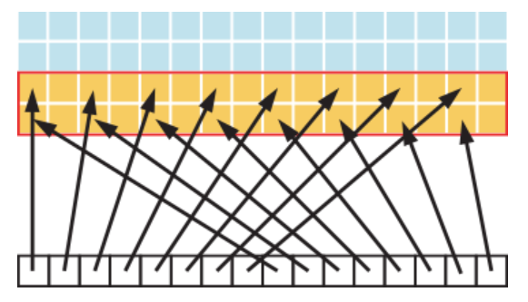

A stride of 2 results in a 50% of load/store efficiency since half the elements in the transaction are not used and represent wasted bandwidth. As the stride increases, the effective bandwidth decreases until the point where 32 32-byte segments are loaded for the 32 threads in a warp.

#### 10.2.2 L2 Cache

##### 10.2.2.1 L2 Cache Access Window

When a CUDA kernel accesses a data region in the global memory repeatedly, such data accesses can be considered to be *persisting*. On the other hand, if the data is only accessed once, such data accesses can be considered to be *streaming*. A portion of the L2 cache can be set aside for persistent accesses to a data region in global memory. If this set-aside portion is not used by persistent accesses, then streaming or normal data accesses can use it.

```C++
cudaGetDeviceProperties(&prop, device_id);
// Set aside max possible size of L2 cache for persisting accesses
cudaDeviceSetLimit(cudaLimitPersistingL2CacheSize, prop.persistingL2CacheMaxSize);
```

Mapping of user data to L2 set-aside portion can be controlled using an access policy window on a CUDA stream or CUDA graph kernel node. The example below shows how to use the access policy window on a CUDA stream.

```C++
cudaStreamAttrValue stream_attribute;    // stream level attribute data structure
stream_attribute.accessPolicyWindow.base_ptr = reinterpret_cast<void*>(ptr);  // global memory data pointer
stream_attribute.accessPolicyWindow.num_bytes = num_bytes; // number of bytes for persisting accesses (Must be less than cudaDeviceProp::accessPolicyMaxWindowSize)

stream_attribute.accessPolicyWindow.hitRatio = 1.0;  // hint for L2 cache hit ratio for persisting accesses in the num_bytes region
stream_attribute.accessPolicyWindow.hitProp = cudaAccessPropertyPersisting; // type of access property on cache hit
stream_attribute.accessPolicyWindow.missProp = cudaAccessPropertyStreaming;  // type of access property on cache miss

cudaStreamSetAttribute(stream, cudaStreamAttributeAccessPolicyWindow, &stream_attribute);
```

>Depending on the value of the `num_bytes` parameter and the size of L2 cache, one may need to tune the value of `hitRatio` to avoid thrashing of L2 cache lines. (缓存行抖动)

##### 10.2.2.2 Tuning the Access Window Hit-Ratio

For example, if the `hitRatio` value is 0.6, 60% of the memory accesses in the global memory region (ptr..ptr+num_bytes) have the persisting property and 40% of the memory accesses have the streaming property.

For example. This microbenchmark uses a 1024 MB region in GPU global memory. First, we set aside 30 MB of the L2 cache for persisting accesses using `cudaDeviceSetLimit()`, as discussed above. Then, as shown in the figure below, we specify that the accesses to the first `freqSize * sizeof(int)` bytes of the memory region are persistent. This data will thus use the L2 set-aside portion. In our experiment, we vary the size of this persistent data region from 10 MB to 60 MB to model various scenarios where data fits in or exceeds the available L2 set-aside portion of 30 MB. Note that the NVIDIA Tesla A100 GPU has 40 MB of total L2 cache capacity. Accesses to the remaining data of the memory region (i.e., streaming data) are considered normal or streaming accesses and will thus use the remaining 10 MB of the non set-aside L2 portion (unless part of the L2 set-aside portion is unused).

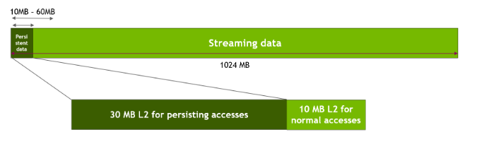

```C++
__global__ void kernel(int *data_persistent, int *data_streaming, int dataSize, int freqSize) {
    int tid = blockIdx.x * blockDim.x + threadIdx.x;

    data_persistent[tid%freqSize] = 2*data_persistent[tid%freqSize];
    data_streaming[tid%dataSize] = 2*data_streaming[tid%dataSize];
}

stream_attribute.accessPolicyWindow.base_ptr = reinterpret_cast<void*>(data_persistent);
stream_attribute.accessPolicyWindow.num_bytes = freqSize*sizeof(int);
stream_attribute.accessPolicyWindow.hitRatio = 1.0;
```

When the persistent data region fits well into the 30MB set-aside portion of the L2 cache, a performance increase of as much as 50% is observed. However, once the size of this persistent data region exceeds the size of the L2 set-aside cache portion, approximately 10% performance drop is observed due to thrashing of L2 cache lines.

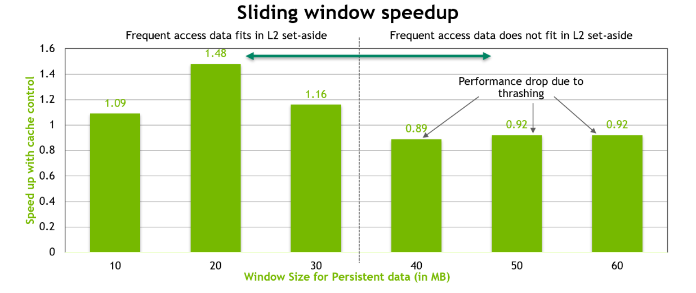

In order to optimize the performance, when the size of the persistent data is more than the size of the set-aside L2 cache portion, we tune the num_bytes and hitRatio parameters in the access window as below.

```C++
stream_attribute.accessPolicyWindow.base_ptr = reinterpret_cast<void*>(data_persistent);
stream_attribute.accessPolicyWindow.num_bytes = 20*1024*1024;
stream_attribute.accessPolicyWindow.hitRatio = (20*1024*1024)/((float)freqSize*sizeof(int)); // Such that up to 20MB of data is resident.
```

A random 20 MB of the total persistent data is resident in the L2 set-aside cache portion. The remaining portion of this persistent data will be accessed using the streaming property. This helps in reducing cache thrashing. We could see good performance regardless of whether the persistent data fits in the L2 set-aside or not.

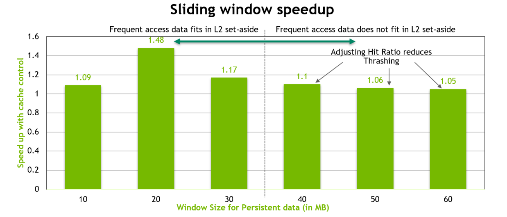

#### 10.2.3 Shared Memory

##### 10.2.3.1 Shared Memory and Memory Banks

To achieve high memory bandwidth for concurrent accesses, shared memory is divided into equally sized memory modules (banks) that can be accessed simultaneously. Therefore, **any memory load or store of n addresses that spans n distinct memory banks can be serviced simultaneously, yielding an effective bandwidth that is n times as high as the bandwidth of a single bank.** However, if multiple addresses of a memory request map to the same memory bank, the accesses are serialized. The one exception here is when multiple threads in a warp address the same shared memory location, resulting in a broadcast. 

>On devices of compute capability 5.x or newer, each bank has a bandwidth of 32 bits every clock cycle, and successive 32-bit words are assigned to successive banks. The warp size is 32 threads and the number of banks is also 32, so bank conflicts can occur between any threads in the warp. 

##### 10.2.3.2 Shared Memory in Matrix Multiplication(C=AB)

A of dimension Mxw, B of dimension wxN, and C of dimension MxN.

A natural decomposition of the problem is to use a block and tile size of wxw threads. Therefore, in terms of wxw tiles, A is a column matrix, B is a row matrix, and C is their outer product. A grid of N/w by M/w blocks is launched, where each thread block calculates the elements of a different tile in C from a single tile of A and a single tile of B.

```C++
__global__ void simpleMultiply(float *a, float *b , float *c, int N) {
    int row = blockIdx.y * blockDim.y + threadIdx.y;
    int col = blockIdx.x * blockDim.x + threadIdx.x; // x是主变量

    float sum = 0.0;
    for (int i = 0; i < TILE_DIM; ++i) {
        sum += a[row*TILE_DIM+i]*b[i*N+col];
    }
    c[row*N+col] = sum;
}
// blockDim.x, blockDim.y, and TILE_DIM are all equal to w
```

For each iteration i of the for loop, the threads in a warp read a row of the B tile, which is a sequential and coalesced access for all compute capabilities.

However, for each iteration i, all threads in a warp read the same value from global memory for matrix A, as the index row*TILE_DIM+i is constant within a warp. There is wasted bandwidth in the transaction, because only one 4-byte word out of 8 words in a 32-byte cache segment is used. We can reuse this cache line in subsequent iterations of the loop, and we would eventually utilize all 8 words; however, when many warps execute on the same multiprocessor simultaneously, as is generally the case, the cache line may easily be evicted from the cache between iterations i and i+1.

```C++
__global__ void coalescedMultiply(float *a, float *b, float * c, int N) {
    __shared__ float aTile[TILE_DIM][TILE_DIM];

    int row = blockIdx.y*blockDim.y + threadIdx.y;
    int col = blockIdx.x*blockDim.x + threadIdx.x;
    float sum = 0.0f;

    aTile[threadIdx.y][threadIdx.x] = a[row*TILE_DIM + threadId.x];
    __syncwarp();

    for (int i = 0; i < TILE_DIM; ++i) {
        sum += aTile[threadIdx.y][i] * b[i*N+col];
    }
    c[row*N+col] = sum;
}
```

```C++
__global__ void sharedABMultiply(float *a, float* b, float *c,
                                 int N)
{
    __shared__ float aTile[TILE_DIM][TILE_DIM],
                     bTile[TILE_DIM][TILE_DIM];
    int row = blockIdx.y * blockDim.y + threadIdx.y;
    int col = blockIdx.x * blockDim.x + threadIdx.x;
    float sum = 0.0f;
    aTile[threadIdx.y][threadIdx.x] = a[row*TILE_DIM+threadIdx.x];
    bTile[threadIdx.y][threadIdx.x] = b[threadIdx.y*N+col];
    __syncthreads();
    for (int i = 0; i < TILE_DIM; i++) {
        sum += aTile[threadIdx.y][i]* bTile[i][threadIdx.x];
    }
    c[row*N+col] = sum;
}
```

##### 10.2.3.3 Shared Memory in Matrix Multiplication(C=AAT)

```C++
__global__ void simpleMultiply(float *a, float *c, int M)
{
    int row = blockIdx.y * blockDim.y + threadIdx.y;
    int col = blockIdx.x * blockDim.x + threadIdx.x;
    float sum = 0.0f;
    for (int i = 0; i < TILE_DIM; i++) {
        sum += a[row*TILE_DIM+i] * a[col*TILE_DIM+i]; // strided access
    }
    c[row*M+col] = sum;
}
```

```C++
__global__ void coalescedMultiply(float *a, float *c, int M) {
    __shared float aTile[TILE_DIM][TILE_DIM],
                    transposedTile[TILE_DIM][TILE_DIM];
    int row = blockIdx.y*blockDim.y + threadIdx.y;
    int col = blockIdx.x*blockDim.x + threadIdx.x;
    float sum = 0.0f;
    aTile[threadIdx.y][threadIdx.x] = a[row*TILE_DIM + threadIdx.x];
    transposedTile[threadIdx.x][threadIdx.y] = a[blockIdx.x*blockDim.x*TILE_DIM+threadIdx.y*TILE_DIM+threadIdx.x]; // 写入共享内存是 bank conflict ---> __shared__ float transposedTile[TILE_DIM][TILE_DIM]

    __syncthreads();
    for (int i = 0; i < TILE_DIM; i++) {
        sum += aTile[threadIdx.y][i]* transposedTile[i][threadIdx.x];
    }
    c[row*M+col] = sum;
}
```

##### 10.2.3.4 Asynchronous Copy from Global Memory to Shared Memory

This featur(async-copy) enables CUDA kernels to overlap copying data from global to shared memory with computation. It also avoids an intermediary register file access traditionally present between the global memory read and the shared memory write.

```C++
template <typename T>
__global__ void pipeline_kernel_sync(T *global, uint64_t *clock, size_t copy_count) {
    extern __shared__ char s[];
    T *shared = reinterpret_cast<T*>(s);

    uint64_t clock_start = clock64();
    for (size_t i = 0; i < copy_count; ++i) {
        shared[blockDim.x*i+threadIdx.x] = global[blockDim.x * i + threadIdx.x];
    }
    uint64_t clock_end = clock64();

    atomicAdd(reinterpret_cast<unsigned long long*>(clock), clock_end-clock_start);
}

template <typename T>
__global__ void pipeline_kernel_async(T *global, uint64_t *clock, size_t copy_count) {
    extern __shared__ chars s[];
    T *shared = reinterpret_cast<T*>(s);

    uint64_t clock_start = clock64();
    for (size_t i = 0; i < copy_count; ++i) {
        __pipeline_memcpy_async(&shared[blockDimx*i + threadIdx.x], &global[blockDim.x*i + threadIdx.x]);
    }
    __pipeline_commit();
    __pipeline_wait_prior(0);

    uint64_t clock_end = clock64();

    atomicAdd(reinterpret_cast<unsigned long long*>(clock), clock_end-clock_start);
}
```

The synchronous version for the kernel loads an element from global memory to an intermediate register and then stores the intermediate register value to shared memory. In the asynchronous version of the kernel, instructions to load from global memory and store directly into shared memory are issued as soon as `__pipeline_memcpy_async()` function is called. The `__pipeline_wait_prior(0)` will wait until all the instructions in the pipe object have been executed. Not using intermediate registers can help reduce register pressure and can increase kernel occupancy. Data copied from global memory to shared memory using asynchronous copy instructions can be cached in the L1 cache or the L1 cache can be optionally bypassed. If individual CUDA threads are copying elements of 16 bytes, the L1 cache can be bypassed. 

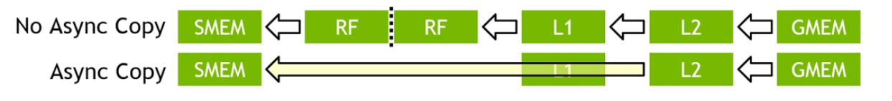

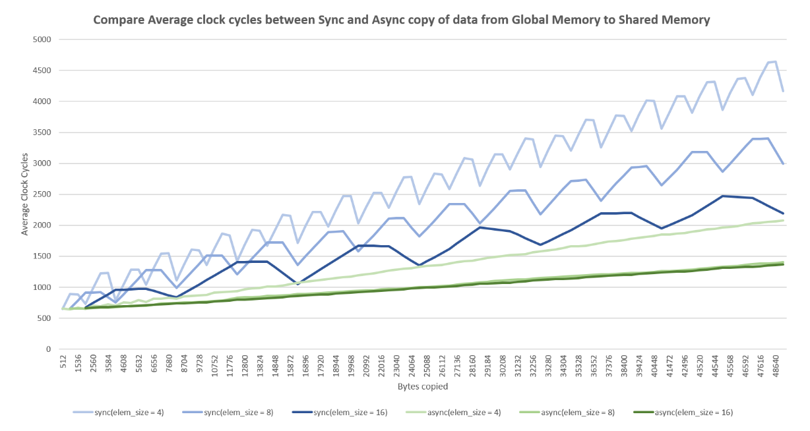

#### 10.2.4 Local Memory

>Local memory is so named because its scope is local to the thread, not because of its physical location. In fact, local memory is off-chip. Hence, access to local memory is as expensive as access to global memory. 

#### 10.2.5 Texture Memory

The read-only texture memory space is cached. Therefore, a texture fetch costs one device memory read only on a cache miss; otherwise, it just costs one read from the texture cache. 

The texture cache is optimized for 2D spatial locality, so threads of the same warp that read texture addresses that are close together will achieve best performance. Texture memory is also designed for streaming fetches with a constant latency; that is, a cache hit reduces DRAM bandwidth demand, but not fetch latency.

#### 10.2.6 Constant Memory

There is a total of 64 KB constant memory on a device. The constant memory space is cached. As a result, a read from constant memory costs one memory read from device memory only on a cache miss; otherwise, it just costs one read from the constant cache. Accesses to different addresses by threads within a warp are serialized, thus the cost scales linearly with the number of unique addresses read by all threads within a warp. As such, the constant cache is best when threads in the same warp accesses only a few distinct locations. **If all threads of a warp access the same location, then constant memory can be as fast as a register access.**

#### 10.2.7 Registers

Generally, accessing a register consumes zero extra clock cycles per instruction, but delays may occur due to register **read-after-write dependencies** and register memory bank conflicts. The compiler and hardware thread scheduler will schedule instructions as optimally as possible to avoid register memory bank conflicts. An application has no direct control over these bank conflicts.

##### 10.2.7.1 Register Pressure

Register pressure occurs when there are not enough registers available for a given task. Even though each multiprocessor contains thousands of 32-bit registers, these are partitioned among concurrent threads. To prevent the compiler from allocating too many registers, use the `-maxrregcount=N` compiler command-line option or the launch bounds kernel definition qualifier  to control the maximum number of registers to allocated per thread.

### 10.3 Allocation

Device memory allocation and de-allocation via `cudaMalloc()` and `cudaFree()` are expensive operations. It is recommended to use `cudaMallocAsync()` and `cudaFreeAsync()` which are stream ordered pool allocators to manage device memory.

### 10.4 NUMA Best Practices

For optimal performance, users should manually tune the NUMA characteristics of their application.


