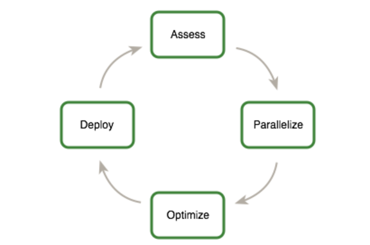

# CUDA  C++ Best Practices Guide

>In order to profit from any modern processor architecture, GPUs included, the first steps are to assess the application to identify the hotspots, determine whether they can be parallelized, and understand the relevant workloads both now and in the future.

### 2.2 Assess,Parallelize,Optimize,Deploy

APOD is a cyclical process: initial speedups can be achieved, tested, and deployed with only minimal initial investment of time, at which point the cycle can begin again by identifying further optimization opportunities, seeing additional speedups, and then deploying the even faster versions of the application into production.



#### 2.2.1 Assess

**For an existing project, the first step is to assess the application to locate the parts of the code that are responsible for the bulk of the execution time.** Armed with this knowledge, the developer can evaluate these bottlenecks for parallelization and start to investigate GPU acceleration.

By understanding the end-user's requirements and constraints and by applying Amdahl's and Gustafson's laws, the developer can determine the upper bound of performance improvement from acceleration of the identified portions of the application.

> Amdahl's Law: **阿姆达尔定律**是**固定负载**（计算总量不变时）时的量化标准
> $$
> s = \frac{1}{(1-\alpha)+\alpha/k}
> $$
> Gustafson's Law: Amdahl定律有一个重要前提，就是处理的数据集大小是固定的，但是这在大数据计算的领域里，这个假设并不经常能达到，因为人们总是会为了在短时间内处理更多的数据，而为了达到目的，往往会在计算集群增加更多的处理器。Gustafson 认为，串行部分代码比例固定的前提加，加速比会随着处理器个数增加而增加。
> $$
> s_p=\frac{t_{seq}+p\times t_{par}}{t_{seq}+t_{par}}
> $$
> 串行代码的比例$a_{seq} = \frac{t_{seq}}{t_{seq}+t_{par}},a_{par}=\frac{t_{par}}{t_{seq}+t_{par}}$,则
> $$
> s_p=a_{seq}+p\times a_{par}
> $$ 
> 已知$a_{seq}$是固定的，那么加速比$s_p$就会向$p\times a_{par}$

#### 2.2.2 Parallelize

Depending on the original code, this can be as simple as calling into an existing GPU-optimized library such as `cuBLAS`,`cuFFT`,or `Thrust`, or it could be as simple as adding a few preprocessor directives as hints to a parallelizing compiler.

On the other hand, some applications’ designs will require some amount of refactoring to expose their inherent parallelism. As even CPU architectures will require exposing parallelism in order to improve or simply maintain the performance of sequential applications, the CUDA family of parallel programming languages (CUDA C++, CUDA Fortran, etc.) aims to make the expression of this parallelism as simple as possible, while simultaneously enabling operation on CUDA-capable GPUs designed for maximum parallel throughput.

#### 2.2.3 Optimize

After each round of application parallelization is complete, the developer can move to optimizing the implementation to improve performance. However, as with APOD as a whole, program optimization is an iterative process (identify an opportunity for optimization, apply and test the optimization, verify the speedup achieved, and repeat), meaning that it is not necessary for a programmer to spend large amounts of time memorizing the bulk of all possible optimization strategies prior to seeing good speedups. **Instead, strategies can be applied incrementally as they are learned.**

Optimizations can be applied at various levels, **from overlapping data transfers with computation all the way down to fine-tuning floating-point operation sequences.** The available profiling tools are invaluable for guiding this process, as they can help suggest a next-best course of action for the developer’s optimization efforts and provide references into the relevant portions of the optimization section of this guide.

#### 2.2.4 Deploy

Having completed the GPU acceleration of one or more components of the application it is possible to compare the outcome with the original expectation. **Recall that the initial assess step allowed the developer to determine an upper bound for the potential speedup attainable by accelerating given hotspots.**

Before tackling other hotspots to improve the total speedup, the developer should consider taking the partially parallelized implementation and carry it through to production. This is important for a number of reasons; for example, it allows the user to profit from their investment as early as possible (the speedup may be partial but is still valuable), and it minimizes risk for the developer and the user by providing an evolutionary rather than revolutionary set of changes to the application.

## 3 Heterogeneous Computing

### 3.1 Differences between Host and Device

**Threading resources**

For example, servers that have two 32 core processors can run only 64 threads concurrently (or small multiple of that if the CPUs support simultaneous multithreading). By comparison, the smallest executable unit of parallelism on a CUDA device comprises 32 threads (termed a warp of threads). Modern NVIDIA GPUs can support up to 2048 active threads concurrently per multiprocessor On GPUs with 80 multiprocessors, this leads to more than 160,000 concurrently active threads.

**Threads**

Threads on a CPU are generally heavyweight entities. The operating system must swap threads on and off CPU execution channels to provide multithreading capability. Context switches (when two threads are swapped) are therefore slow and expensive. By comparison, threads on GPUs are extremely lightweight. CPU cores are designed to minimize latency for a small number of threads at a time each, whereas GPUs are designed to handle a large number of concurrent, lightweight threads in order to maximize throughput.

**RAM**

The host system and the device each have their own distinct attached physical memories. As the host and device memories are separated, items in the host memory must occasionally be communicated between device memory and host memory as described in **What Runs on a CUDA-Enabled Device?**.

These are the primary hardware differences between CPU hosts and GPU devices with respect to parallel programming. 
Applications composed with these differences in mind can treat the host and device together as a cohesive heterogeneous system wherein each processing unit is leveraged to do the kind of work it does best: **sequential work on the host and parallel work on the device.**

### 3.2 What Runs on a CUDA-Enabled Device?

This is a requirement for good performance on CUDA: the software must use a large number (generally thousands or tens of thousands) of concurrent threads. The support for running numerous threads in parallel derives from CUDA’s use of a lightweight threading model described above.

The complexity of operations should justify the cost of moving data to and from the device. Code that transfers data for brief use by a small number of threads will see little or no performance benefit. The ideal scenario is one in which many threads perform a substantial amount of work.

For example, transferring two matrices to the device to perform a matrix addition and then transferring the results back to the host will not realize much performance benefit. The issue here is the number of operations performed per data element transferred. For the preceding procedure, assuming matrices of size NxN, there are $N^2$ operations (additions) and $3N^2$ elements transferred, so **the ratio of operations to elements transferred is 1:3 or O(1).** Performance benefits can be more readily achieved when this ratio is higher. For example, a matrix multiplication of the same matrices requires $N^3$ operations (multiply-add), **so the ratio of operations to elements transferred is O(N)**, in which case the larger the matrix the greater the performance benefit. The types of operations are an additional factor, as additions have different complexity profiles than, for example, trigonometric functions. **It is important to include the overhead of transferring data to and from the device in determining whether operations should be performed on the host or on the device.**

**Data should be kept on the device as long as possible**. Because transfers should be minimized, programs that run multiple kernels on the same data should favor leaving the data on the device between kernel calls, rather than transferring intermediate results to the host and then sending them back to the device for subsequent calculations. This approach should be used even if one of the steps in a sequence of calculations could be performed faster on the host. **Even a relatively slow kernel may be advantageous if it avoids one or more transfers between host and device memory.**

**For best performance, there should be some coherence in memory access by adjacent threads running on the device.** Certain memory access patterns enable the hardware to coalesce groups of reads or writes of multiple data items into one operation. 

## 4 Application Profiling

### 4.1 Profile

> High Priority: To maximize  developer productivity, profile the application to determine hotspots and bottlenecks.

**The most important consideration with any profiling activity is to ensure that the workload is realistic** - i.e., that information gained from the test and decisions based upon that information are relevant to real data.

如GNU自带的 C/C++ 单线程性能分析工具 Gprof
```
gcc -o2 -g -pg myprog.c -o a
gprof ./a.out > profile.txt
```

#### 4.1.2 Identifying Hotspots

#### 4.1.3 Understanding Scaling

The amount of performance benefit an application will realize by running on CUDA depends entirely on the extent to which it can be parallelized. Code that cannot be sufficiently parallelized should run on the host, unless doing so would result in excessive transfers between the host and the device.

Strong Scaling and Amdahl’s Law describes strong scaling, which allows us to set an upper bound for the speedup with a fixed problem size. Weak Scaling and Gustafson’s Law describes weak scaling, where the speedup is attained by growing the problem size.

In reality, most applications do not exhibit perfectly linear strong scaling, even if they do exhibit some degree of strong scaling. For most purposes, the key point is that the larger the parallelizable portion P is, the greater the potential speedup. Conversely, if P is a small number (meaning that the application is not substantially parallelizable), increasing the number of processors N does little to improve performance. Therefore, to get the largest speedup for a fixed problem size, it is worthwhile to spend effort on increasing P, maximizing the amount of code that can be parallelized.

**Another way of looking at Gustafson’s Law is that it is not the problem size that remains constant as we scale up the system but rather the execution time.** Note that Gustafson’s Law assumes that the ratio of serial to parallel execution remains constant, reflecting additional cost in setting up and handling the larger problem.

> Having understood the application profile, the developer should understand how the problem size would change if the computational performance changes and then apply either Amdahl’s or Gustafson’s Law to determine an upper bound for the speedup.

## 9 Performance Metrics

#### 9.1.1 Using CPU Timers

```C++
#include <chrono>

auto start = std::chrono::high_resolution_clock::now();
// function
auto end = std::chrono::high_resolution_clock::now();

auto duration = std::chrono::duration_cast<std::chrono::millseconds>(end-start);
std::cout << duration.count() << "\n";
```

#### 9.1.2 Using CUDA GPU Timers

```C++
cudaEvent_t start, stop;
float time;

cudaEventCreate(&start);
cudaEventCreate(&stop);

cudaEventRecord(start, 0);
kernel<<<grid, block>>>(...);
cudaEventRecord(stop, 0);
cudaEventSynchronize(stop);

cudaEventElapsedTime(&time, start, stop); // milliseconds
cudaEventDestroy(start);
cudaEventDestroy(stop);
```

### 9.2 Bandwidth

> High Priority: Use the effective bandwidth of your computation as a metric when measuring performance and optimization benefits.

#### 9.2.1 Theoretical Bandwidth Calculation

For example, the NVIDIA Tesla V100 uses HBM2 (double data rate) RAM with a memory clock rate of 877 MHz and a 4096-bit-wide memory interface. Using these data items, the peak theoretical memory bandwidth of the NVIDIA Tesla V100 is 898 GB/s:
$$
(0.877 * 10^9 * (4096/8)*2)/10^9 = 898 GB/s
$$

#### 9.2.2 Effective Bandwidth Calculation

$$
    Effective bandwidth = ((B_r+B_w)/10^9)/time
$$

$B_r$ is the number of bytes read per kernel, $B_w$ is the number of bytes written per kernel, and time is given  in seconds.


