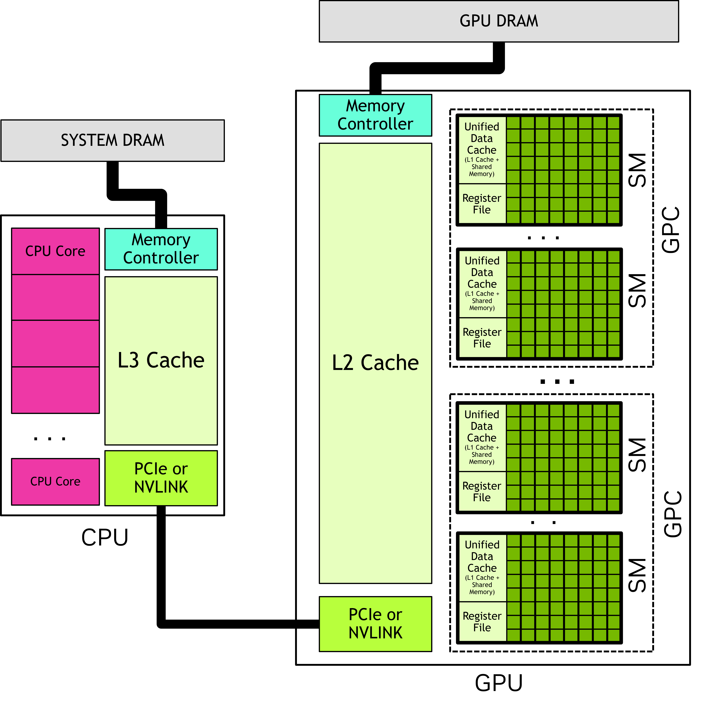

# 1.2 Programming Model

## 1.2.1 Heterogeneous Systems

>CUDA applications execute some part of their code on the GPU, but applications always start execution on the CPU. The host code, which is the code that runs on the CPU, can use CUDA APIs to copy data between the host memory and device memory, start code executing on the GPU, and wait for data copies or GPU code to complete. The CPU and GPU can both be executing code simultaneously, and best performance is usually found by maximizing utilization of both CPUs and GPUs.

## 1.2.2 GPU Hardware Model

>For the purposes of CUDA programming, the GPU can be considered to be a collection of **Streaming Multiprocessors (SMs)** which are organized into groups called Graphics Processing Clusters (GPCs). Each SM contains a local register file, a unified data cache, and a number of functional units that perform computations. The unified data cache provides the physical resources for shared memory and L1 cache. The allocation of the unified data cache to L1 and shared memory can be configured at runtime. 

### 1.2.2.1 Thread Blocks and Grids

>**All threads of a thread block are executed in a single SM.** This allows threads within a thread block to communicate and synchronize with each other efficiently. Threads within a thread block all have access to the on-chip shared memory, which can be used for exchanging information between threads of a thread block.

>There is no guarantee of scheduling between thread blocks, so a thread block cannot rely on results from other thread blocks, as they may not be able to be scheduled until that thread block has completed. 

*Each SM has one or more active thread blocks. In this example, each SM has three thread blocks scheduled simultaneously. There are no guarantees about the order in which thread blocks from a grid are assigned to SMs.*

>The CUDA programming model enables arbitrarily large grids to run on GPUs of any size, whether it has only one SM or thousands of SMs. To achieve this, the CUDA programming model, with some exceptions, requires that there be no data dependencies between threads in different thread blocks. That is, a thread should not depend on results from or synchronize with a thread in a different thread block of the same grid. All the threads within a thread block run on the same SM at the same time. Different thread blocks within the grid are scheduled among the available SMs and may be executed in any order.

#### 1.2.2.1.1. Thread Block Clusters

>GPUs with compute capability 9.0 and higher have an optional level of grouping called clusters. Clusters are a group of thread blocks which, like thread blocks and grids, can be laid out in 1, 2, or 3 dimensions.Specifying clusters does not change the grid dimensions or the indices of a thread block within a grid.

**Specifically, all thread blocks in a cluster are executed in a single GPC.**
>Specifying clusters groups adjacent thread blocks into clusters and provides some additional opportunities for synchronization and communication at the cluster level.

**The thread blocks are scheduled simultaneously and within a single GPC**, threads in different blocks but within the same cluster can communicate and synchronize with each other using software interfaces provided by **Cooperative Groups**. **Threads in clusters can access the shared memory of all blocks in the cluster**, which is referred to as distributed shared memory.The maximum size of a cluster is hardware dependent and varies between devices.

### 1.2.2.2. Warps and SIMT

Within a thread block, threads are organized into groups of 32 threads called warps. A warp executes the kernel code in a Single-Instruction Multiple-Threads (SIMT) paradigm.
>In SIMT, all threads in the warp are executing the same kernel code, but each thread may follow different branches through the code. That is, though all threads of the program execute the same code, threads do not need to follow the same execution path.

**If some threads within a warp follow a control flow branch in execution while others do not, the threads which do not follow the branch will be masked off while the threads which follow the branch are executed.**

**It follows that utilization of the GPU is maximized when threads within a warp follow the same control flow path.**

>SIMT is often compared to Single Instruction Multiple Data (SIMD) parallelism, but there are some important differences. In SIMD, execution follows a single control flow path, while in SIMT, each thread is allowed to follow its own control flow path. Because of this, SIMT does not have a fixed data-width like SIMD. 

## 1.2.3. GPU Memory

**In modern computing systems, efficiently utilizing memory is just as important as maximizing the use of functional units performing computations.**

### 1.2.3.1 DRAM Memory in Heterogeneous Systems

On all currently-supported systems, **the CPU and GPU use a single unified virtual memory space.** This means that the virtual memory address range for each GPU in the system is unique and distinct from the CPU and every other GPU in the system. For a given virtual memory address, it is possible to determine whether that address is in GPU memory or system memory and, on systems with multiple GPUs, which GPU memory contains that address.

### 1.2.3.2 On-chip Memory in GPUs

**Each GPU has some on-chip memory, each SM has its own register file and shared memory.**
Shared memory allocations are done at the thread block level. That is, unlike register allocations which are per thread, allocations of shared memory are common to the entire thread block.

>To schedule a thread block to an SM, the total number of registers needed for each thread multiplied by the number of threads in the thread block must be less than or equal to the available registers in the SM. If the number of registers required for a thread block exceeds the size of the register file, the kernel is not launchable and the number of threads in the thread block must be decreased to make the thread block launchable.

#### 1.2.3.2.1 Caches

GPUs have both L1 and L2 caches. Each SM has an L1 cache which is part of the unified data cache. A larger L2 cache is shared by all SMs within a GPU. 

Each SM also has a separate *constant cache*, which is used to cache values in global memory that have been declared to be constant over the life of a kernel. The compiler may place kernel parameters into constant memory as well. This can improve kernel performance by allowing kernel parameters to be cached in the SM separately from the L1 data cache.

### 1.2.3.3 Unified Memory

**When an application allocates memory explicitly on the GPU or CPU, that memory is only accessible to code running on that device.**
That is, CPU memory can only be accessed from CPU code, and GPU memory can only be accessed from kernels running on the GPU.
(但mapped memory是例外。mapped memory是指CPU分配的内存，但是其属性是可以被GPU直接访问。然而，mapped memory通过PCIe或NVLINK连接，GPU不能通过并行处理掩盖其高延迟和低带宽，所以mapped memory不能有效的替代统一内存或将数据放置在合适的地址空间中。)

>A CUDA feature called unified memory allows applications to make memory allocations which can be accessed from CPU or GPU. The CUDA runtime or underlying hardware enables access or relocates the data to the correct place when needed. Even with unified memory, optimal performance is attained by keeping the migration of memory to a minimum and accessing data from the processor directly attached to the memory where it resides as much as possible.

# 总结

异构系统：主机（Host）与设备（Device）

GPU硬件模型：
核函数启动时，会创建大量线程。线程被组织为grid-block-thread，可以是一维、二维、三维。
每个active block被调度到SM上运行，这个顺序是不确定的。所以不同线程块之间不能相互依赖。
一个block cluster被调度到同一个GPC上运行（一个GPC包含多个SM）。

gpu以32线程为一组进行调度和执行，被称为warp，即SIMT，一个warp中所有的线程在同一时刻执行同一条指令。当发生warp divergence时，即不同线程选择不同的条件分支，不满足条件的分支会被mask off，使得GPU的利用降低。

GPU内存模型：
global memory：显存，所有的SM都可以访问
cpu和gpu时统一的虚拟地址空间

片上内存：
寄存器：每个线程私有
共享内存：每个SM有自己的共享内存。每个block上的thread可以访问同一块共享内存；block cluster上的所有block中的thread都可以访问同一块共享内存。
caches：每个SM内有L1 cache，所有SM共享L2 cache

