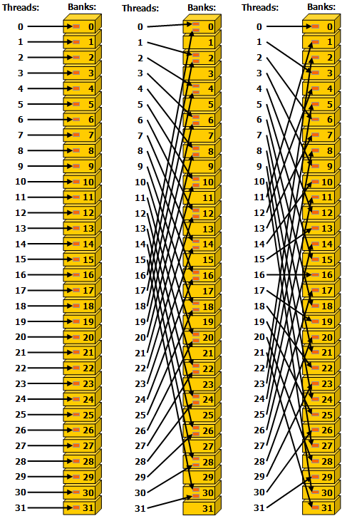
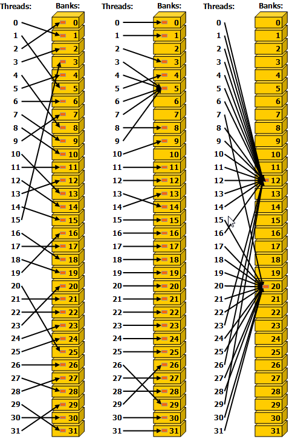

>**Ensuring proper memory usage is key to achieving high performance in CUDA kernels.**

# 2.2.4. Memory Performance

## 2.2.4.1. Coalesced Global Memory Access

Global memory is accessed via 32-byte memory transactions. 
When a CUDA thread requests a word of data from global memory, the relevant warp coalesces the memory requests from all the threads in that warp into the number of memory transactions necessary to satisfy the request, depending on the size of the word accessed by each thread and the distribution of the memory addresses across the threads.

If a thread requests a 4-byte word, the actual memory transaction the warp will generate to global memory will be 32 bytes in total. **To use the memory system most efficiently, the warp should use all the memory that is fetched in a single memory transaction.** That is, if a thread is requesting a 4-byte word from global memory, and the transaction size is 32 bytes, if other threads in that warp can use other 4-byte words of data from that 32-byte request, this will result in the most efficient use of the memory system.

If consecutive threads in the warp request consecutive 4-byte words in memory, then the warp will request 128 bytes of memory total, and this 128 bytes required will be fetched in four 32-byte memory transactions. This results in 100% utilization of the memory system. That is, 100% of the memory traffic is utilized by the warp.


Conversely, the pathologically worst case scenario is when consecutive threads access data elements that are 32 bytes or more apart from each other in memory. In this case, the warp will be forced to issue a 32-byte memory transaction for each thread, and the total number of bytes of memory traffic will be 32 bytes times 32 threads/warp = 1024 bytes. However, the amount of memory used will be 128 bytes only (4 bytes for each thread in the warp), so the memory utilization will only be 128 / 1024 = 12.5%. This is a very inefficient use of the memory system.


**The most straightforward way to achieve coalesced memory access is for consecutive threads to access consecutive elements in memory.**
**Coalesced memory access occurs provided all the threads in the warp access elements from the same 32-byte segments of memory in some linear or permuted way. Stated another way, the best way to achieve coalesced memory access is to maximize the ratio of bytes used to bytes transferred.**

### 2.2.4.1.1. Matrix Transpose Example Using Global Memory

```C++
#define INDEX(row, col, ld) ((row)*(ld) + (col))

__global__ void naive_cuda_transpose(int m, float*a, float* b) {
    int col = blockDim.x * blockIdx.x + threadIdx.x;
    int row = blockDim.y * blockIdx.y + threadIdx.y;

    if (col < m && row < m) {
        b[INDEX(col, row, m)] = a[INDEX(row, col, m)];
    }
}

// the writing of b is not coalesced
```

## 2.2.4.2. Shared Memory Access Patterns

**Shared memory has 32 banks that are organized such that successive 32-bit words map to successive banks. Each bank has a bandwidth of 32 bits per clock cycle.**

When multiple threads in the same warp attempt to access different elements in the same bank, a bank conflict occurs.
In this case, the access to the data in that bank will be serialized until the data in that bank has been obtained by all the threads that have requested it. This serialization of access results in a performance penalty.

**The two exceptions to this scenario happen when multiple threads in the same warp are accessing (either reading or writing) the same shared memory location. For read accesses, the word is broadcast to the requesting threads. For write accesses, each shared memory address is written by only one of the threads (which thread performs the write is undefined(竞态)).**
The red box inside the bank indicates a unique location in shared memory.

*Left: Linear addressing with a stride of one 32-bit word (no bank conflict).*
*Middle: Linear addressing with a stride of two 32-bit words (two-way bank conflict).*
*Right: Linear addressing with a stride of three 32-bit words (no bank conflict).*

The red box inside the bank indicates a unique location in shared memory. If multiple arrows point to the same location, the data is broadcast to all threads that requested it.

*Left: Conflict-free access via random permutation.*
*Middle: Conflict-free access since threads 3, 4, 6, 7, and 9 access the same word within bank 5.*
*Right: Conflict-free broadcast access (threads access the same word within a bank).*

### 2.2.4.2.1. Matrix Transpose Example Using Shared Memory

```C++
constexpr int THREADS = 32;
#define INDEX(row, col, ld) ((row)*(ld) + (col))

__global__ void smem_cuda_transpose(int m, float* a, float* b) {
    __shared__ float smem[THREADS][THREADS];

    int tileCol = blockDim.x * blockIdx.x;
    int tileRow = blockDim.y * blockIdx.y;

// Note that because threadIdx.x appears in the second argument to INDX, consecutive threads are accessing consecutive elements in memory, and the read of a is perfectly coalesced.
// 32-way bank conflict
    smem[threadIdx.x][threadIdx.y] = a[INDEX(tileRow + threadIdx.y, tileCol + threadIdx.x, m)];
    __syncthreads();

// no bank conflicts
    b[INDEX(tileCol + threadIdx.y, tileRow + threadIdx.x, m)] = smem[threadIdx.y][threadIdx.x];
}
```

### 2.2.4.2.2. Shared Memory Bank Conflicts

```C++
__shared__ float smem[32][32];
```

(threadIdx.x moves the fastest)
The left panel of Figure illustrates the situation when the threads in a warp access the data in a column of smemArray. Warp 0 is accessing memory locations smemArray[0][0] through smemArray[31][0].so consecutive threads in warp 0 are accessing memory locations that are 32 elements apart. As illustrated in the figure, the colors denote the banks, and **this access down the entire column by warp 0 results in a 32-way bank conflict.**
The right panel of Figure illustrates the situation when the threads in a warp access the data across a row of smemArray. Warp 0 is accessing memory locations smemArray[0][0] through smemArray[0][31]. In this case, consecutive threads in warp 0 are accessing memory locations that are adjacent. As illustrated in the figure, the colors denote the banks, and **this access across the entire row by warp 0 results in no bank conflicts.** The ideal scenario is for each thread in a warp to access a shared memory location with a different color.


A common fix to avoid bank conflicts is to pad the shared memory by adding one to the column dimension of the array as follows:
```C++
__shared__ float smem[THREADS][THREADS+1];
```

the shared memory array has been declared with a size of 32 x 33. One observes that whether the threads in the same warp access the shared memory array down an entire column or across an entire row, the bank conflicts have been eliminated.


