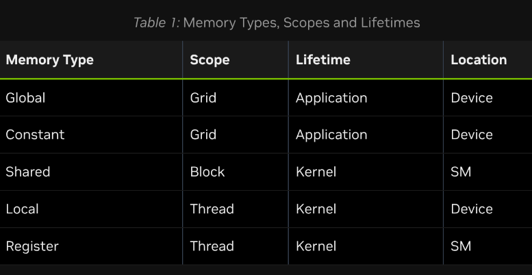

# 2.2. Writing CUDA SIMT Kernels

>CUDA C++ kernels can largely be written in the same way that traditional CPU code would be written for a given problem. However, there are some unique features of the GPU that can be used to improve performance. Additionally, some understanding of how threads on the GPU are scheduled, how they access memory, and how their execution proceeds can help developers write kernels that maximize utilization of the available computing resources.

## 2.2.1 Basics of SIMT

The SIMT model allows each thread to maintain its own state and control flow. From a functional perspective, each thread can execute a separate code path. However, substantial performance improvements can be realized by taking care that kernel code minimizes the situations where threads in the same warp take divergent code paths.

## 2.2.2. Thread Hierarchy

The use of multi-dimensional thread blocks and grids is for convenience only and does not affect performance. The threads of a block are linearized predictably: the first index x moves the fastest, followed by y and then z. This means that in the linearization of a thread indices, consecutive values of `threadIdx.x` indicate consecutive threads, `threadIdx.y` has a stride of `blockDim.x`, and `threadIdx.z` has a stride of `blockDim.x * blockDim.y`.

## 2.2.3. GPU Device Memory Spaces

### 2.2.3.1. Global Memory

Global memory is persistent. That is, an allocation made in global memory and the data stored in it persist until the allocation is freed or until the application is terminated. `udaDeviceReset` also frees all allocations.

Because global memory is accessible by all threads in a grid, care must be taken to avoid data races between threads. Since CUDA kernels launched from the host have the return type `void`, the only way for numerical results computed by a kernel to be returned to the host is by writing those results to global memory.

