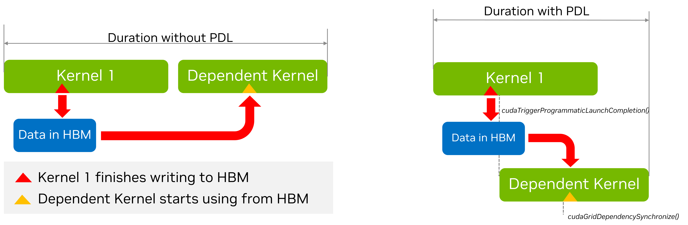

# 3.1. Advanced CUDA APIs and Features

## 3.1.1. cudaLaunchKernelEx

## 3.1.2. Launching Clusters

- Launching with Clusters using `cudaLaunchKernelEx`
[distributed shared memory](example/Distributed-Shared-Memory.cu)

- blocks as clusters
[thread block clusters](2.1Intro-CUDAC++.md#2110-thread-block-clusters)

A kernel can alternatively use the __block_size__ annotation, which specifies both the required block size and cluster size at the time the kernel is defined. When this annotation is used, the triple chevron launch becomes the grid dimension in terms of clusters rather than thread blocks, as shown below.

```C++
__cluster_dims__((2, 2, 2)) __global__ void foo()；
// 8x8x8 clusters with 2x2x2 thread blocks
foo<<<dim3(16, 16, 16), dim3(1024, 1, 1)>>>();

__block_size__((1024,1,1), (2, 2, 2)) __global__ void foo();
// 8x8x8 clusters
foo<<<dim3(8, 8, 8)>>>();
```

## 3.1.3. More on Streams and Events

>Independent operations from different CUDA streams cannot run concurrently if any CUDA operation on the NULL stream is submitted in between them, unless the streams are non-blocking CUDA streams. These are streams created with cudaStreamCreateWithFlags() runtime API with the cudaStreamNonBlocking flag. **To improve potential for concurrent GPU work execution, it is recommended that the user creates non-blocking CUDA streams.**

It is also recommended that the user selects the least general synchronization option that is sufficient for their problem. For example, if the requirement is for the CPU to wait (block) for all work on a specific CUDA stream to complete, **using `cudaStreamSynchronize()` for that stream would be preferable to `cudaDeviceSynchronize()`,** as the latter would unnecessarily wait for GPU work on all CUDA streams of the device to complete. And if the requirement is for the CPU to wait without blocking, then using `cudaStreamQuery()` and checking its return value, in a polling loop, may be preferable.
by recording an event on that stream and calling `cudaEventSynchronize()` to wait, in a blocking manner, for the work captured in that event to complete. Again, this would be preferable and more focused than using `cudaDeviceSynchronize()`. Calling `cudaEventQuery()` and checking its return value, e.g., in a polling loop, would be a non-blocking alternative.

For synchronization, i.e., to express dependencies, between CUDA streams, use of non-timing CUDA events is recommended. A user can call `cudaStreamWaitEvent()` to force future submitted operations on a specific stream to wait for the completion of a previously recorded event (e.g., on another stream). Note that for any CUDA API waiting or querying an event, it is the responsibility of the user to ensure the cudaEventRecord API has been already called, as a non-recorded event will always return success.

CUDA events carry, by default, timing information, as they can be used in `cudaEventElapsedTime()` API calls. However, **a CUDA event that is solely used to express dependencies across streams does not need timing information. For such cases, it is recommended to create events with timing information disabled for improved performance.** This is possible using `cudaEventCreateWithFlags()` API with the `cudaEventDisableTiming` flag.

### 3.1.3.1. Stream Priorities

The relative priorities of streams can be specified at creation time using `cudaStreamCreateWithPriority()`. The range of allowable priorities, ordered as [greatest priority, least priority] can be obtained using the `cudaDeviceGetStreamPriorityRange()` function. 
At runtime, the GPU scheduler utilizes stream priorities to determine task execution order, **but these priorities serve as hints rather than guarantees.**
When selecting work to launch, pending tasks in higher-priority streams take precedence over those in lower-priority streams. Higher-priority tasks do not preempt already running lower-priority tasks. (不抢占)
Stream priorities influence task execution without enforcing strict ordering, so users can leverage stream priorities to influence task execution without relying on strict ordering guarantees.

```C++
// get the range of stream priorities for this device
int leastPriority, greatestPriority;
cudaDeviceGetStreamPriorityRange(&leastPriority, &greatestPriority);

// create streams with highest and lowest available priorities
cudaStream_t st_high, st_low;
cudaStreamCreateWithPriority(&st_high, cudaStreamNonBlocking, greatestPriority));
cudaStreamCreateWithPriority(&st_low, cudaStreamNonBlocking, leastPriority);
```

### 3.1.3.2. Explicit Synchronization

[Explicit Synchronization](2.3Asynchronous-Execution.md#237-explicit-synchronization)

### 3.1.3.3. Implicit Synchronization

Two commands from different streams cannot run concurrently if any one of the following operations is issued in-between them by the host thread:

- a page-locked host memory allocation
- a device memory allocation
- a device memory set
- a memory copy between two addresses to the same device memory
- any CUDA command to the NULL stream
- a switch between the L1/shared memory configurations

**Therefore, applications should follow these guidelines to improve their potential for concurrent kernel execution: All independent operations should be issued before dependent operations, Synchronization of any kind should be delayed as long as possible.**

## 3.1.4 Programmatic Dependent Kernel Launch

>As we have discussed earlier, the semantics of CUDA Streams are such that kernels execute in order. This is so that if we have two successive kernels, where the second kernel depends on results from the first one, the programmer can be safe in the knowledge that by the time the second kernel starts executing the dependent data will be available. 

Likewise the dependent second kernel may have some independent work before it needs the data from the first kernel. **In such a situation it is possible to partially overlap the execution of the two kernels (assuming that hardware resources are available).** The overlapping can also overlap the launch overheads of the second kernel too. Other than the availability of hardware resources,the degree of overlap which can be achieved is dependent on the specific structure of the kernels, such as

- when in its execution does the first kernel finish the work on which the second kernel depends?
- when in its execution does the second kernel start working on the data from the first kernel?

since this is very much dependent on the specific kernels in question it is difficult to automate completely and hence CUDA provides a mechanism to allow the application developer to specify the synchronization point between the two kernels. This is done via a technique known as Programmatic Dependent Kernel Launch. The situation is depicted in the figure below.


PDL has three main components
i.The first kernel (the so called primary kernel) needs to call a special function to indicate that it is done with the everything that the subsequent dependent kernels (also called secondary kernel) will need. This is done by calling the function `cudaTriggerProgrammaticLaunchCompletion()`.
ii. In turn, the dependent secondary kernel needs to indicate that it has reached the portion of the its work which is independent of the primary kernel and that it is now waiting on the primary kernel to finish the work on which it depends. This is done with the function `cudaGridDependencySynchronize()`.
iii. The second kernel needs to be launched with a special attribute cudaLaunchAttributeProgrammaticStreamSerialization with its programmaticStreamSerializationAllowed field set to ‘1’.

```C++
__global__ void primary_kernel() {
    //

    // Trigger the secondary kernel
    cudaTriggerProgrammaticLaunchCompletion();

    //
}

__global__ void secondary_kernel() {
    // 

    // Will block until all primary kernels the secondary kernel is dependent on have completed and flushed results to global memory
    cudaGridDependencySynchronize();

    // 
}

// set up the attribute
cudaLaunchAttribute attribute[1];
attribute[0].id = cudaLaunchAttributeProgrammaticStreamSerialization;
attribute[0].val.programmaticStreamSerializationAllowed = 1;

cudaLaunchConfig_t config = {0};
config.gridDim  = grid_dim;
config.blockDim = block_dim;
config.dynamicSmemBytes = 0;
config.stream = stream;
config.attrs = attribute;
config.numAttrs = 1;

primary_kernel<<<grid_dim, block_dim, 0, stream>>>();
// Launch secondary(dependent) kernel using the configuration with the attribute
cudaLaunchKernelEx(&config, secondary_kernel);
```

## 3.1.5 Batched Memory Transfers

>Generally as with CUDA Graphs, and PDL, the purpose of batching is to reduce overheads associated with dispatching the individual batch tasks separately. In terms of memory transfers launching a memory transfer can incur some CPU and driver overheads. Further, the regular `cudaMemcpyAsync()` function in its current form does not necessarily provide enough information for the driver to optimize the transfer, for example, in terms of hints about the source and destination. On Tegra platforms one has the choice of using SMs or Copy Engines (CEs)o perform transfers. The choice of which is currently specified by a heuristic in the driver. This can be important because using the SMs may result in a faster transfer, however it ties down some of the available compute power. On the other hand, using the CEs may result in a slower transfer but overall higher application performance, since it leaves the SMs free to perform other work.

These considerations motivated the design of the `cudaMemcpyBatchAsync()` function (and its relative `cudaMemcpyBatch3DAsync()`). These functions allow batched memory transfers to be optimized. Apart from the lists of source and destination pointers, the API uses memory copy attributes to specify expectations of orderings, with hints for source and destination locations, as well as for whether one prefers to overlap the transfer with compute (something that is currently only supported on Tegra platforms with CEs).

```C++
std::vector<void*> srcs(batch_size);
std::vector<void*> dsts(batch_size);
std::vector<void*> sizes(batch_size);

for (size_t i = 0; i < batch_size; i++) {
    cudaMallocHost(&srcs[i], sizes[i]);
    cudaMalloc(&dsts[i], sizes[i]);
    cudaMemsetAsync(srcs[i], sizes[i], stream);
}

cudaMemcpyAttributes attrs = {};
attrs.srcAccessOrder = cudaMemcpySrcAccessOrderStream;
// All copies in the batch have same copy attributes
size_t attrsIdxs = 0;

cudaMemcpyBatchAsync(&dsts[0], &srcs[0], &sizes[0], batch_size, &attrs, &attrsIdxs, 1 /*numAttrs*/, nullptr /*failIdx*/, stream);
```

Turning to the attributes, in this instance the transfers are homogeneous. So we use only one attribute, which will apply to all the transfers. This is controlled by the attrIndex parameter. In principle this can be an array. Element i of the array contains the index of the first transfer to which the i-th element of the attribute array applies. In this case, attrIndex is treated as a single element array, with the value ‘0’ meaning that attribute[0] will apply to all transfers with index 0 and up, in other words all the transfers.
Finally, we note that we have set the `srcAccessOrder` attribute to `cudaMemcpySrcAccessOrderStream`. This means that the source data will be accessed in regular stream order. **In other words, the memcpy will block until previous kernels dealing with the data from any of these source and destination pointers are completed.**

```C++
std::vector<void *> srcs(batch_size);
std::vector<void *> dsts(batch_size);
std::vector<void *> sizes(batch_size);

// Allocate the src and dst buffers
for (size_t i = 0; i < batch_size - 10; i++) {
    cudaMallocHost(&srcs[i], sizes[i]);
    cudaMalloc(&dsts[i], sizes[i]);
}

int buffer[10];

for (size_t i = batch_size - 10; i < batch_size; i++) {
    srcs[i] = &buffer[10 - (batch_size - i];
    cudaMalloc(&dsts[i], sizes[i]);
}

// Setup attributes for this batch of copies
cudaMemcpyAttributes attrs[2] = {};
attrs[0].srcAccessOrder = cudaMemcpySrcAccessOrderStream;
attrs[1].srcAccessOrder = cudaMemcpySrcAccessOrderDuringApiCall;

size_t attrsIdxs[2];
attrsIdxs[0] = 0;
attrsIdxs[1] = batch_size - 10;

// Launch the batched memory transfer
cudaMemcpyBatchAsync(&dsts[0], &srcs[0], &sizes[0], batch_size,
    &attrs, &attrsIdxs, 2 /*numAttrs*/, nullptr /*failIdx*/, stream);
```

The buffer array is not only on the host but is only in existence in the current scope – its address is what is known as an ephemeral pointer. This pointer may not be valid after the API call completes (it is asynchronous). To perform the copies with such ephemeral pointers, the srcAccessOrder in the attribute must be set to cudaMemcpySrcAccessOrderDuringApiCall.
If instead of allocating the buffer array from the stack, we had allocated it from the heap using malloc the data would not be ephemeral any more. It would be valid until the pointer was explicitly freed. In such a case the best option for how to stage the copies would depend on whether the system had hardware managed memory or coherent GPU access to host memory via address translation in which case it would be best to use stream ordering, or whether it did not in which case staging the transfers immediately would make most sense. In this situation, one should use the value `cudaMemcpyAccessOrderAny` for the `srcAccessOrder` of the attribute.

The `cudaMemcpyBatchAsync` function also allows the programmer to provide hints about the source and destination locations. This is done by setting the `srcLocation` and `dstLocation` fields of the cudaMemcpyAttributes structure. The srcLocation and dstLocation fields are both of type `cudaMemLocation` which is a structure that contains the type of the location and the ID of the location. This is the same `cudaMemLocation` structure that can be used to give prefetching hints to the runtime when using `cudaMemPrefetchAsync()`. 

```C++
// Allocate the source and destination buffers
std::vector<void *> srcs(batch_size);
std::vector<void *> dsts(batch_size);
std::vector<void *> sizes(batch_size);

// cudaMemLocation structures we will use tp provide location hints
// Device device_id
cudaMemLocation srcLoc = {cudaMemLocationTypeDevice, dev_id};

// Host with numa Node numa_id
cudaMemLocation dstLoc = {cudaMemLocationTypeHostNuma, numa_id};

// Allocate the src and dst buffers
for (size_t i = 0; i < batch_size; i++) {
    cudaMallocManaged(&srcs[i], sizes[i]);
    cudaMallocManaged(&dsts[i], sizes[i]);

    cudaMemPrefetchAsync(srcs[i], sizes[i], srcLoc, 0, stream);
    cudaMemPrefetchAsync(dsts[i], sizes[i], dstLoc, 0, stream);
    cudaMemsetAsync(srcs[i], sizes[i], stream);
}

// Setup attributes for this batch of copies
cudaMemcpyAttributes attrs = {};

// These are managed memory pointers so Stream Order is appropriate
attrs.srcAccessOrder = cudaMemcpySrcAccessOrderStream;

// Now we can specify the location hints here.
attrs.srcLocHint = srcLoc;
attrs.dstlocHint = dstLoc;

// All copies in the batch have same copy attributes.
size_t attrsIdxs = 0;

// Launch the batched memory transfer
cudaMemcpyBatchAsync(&dsts[0], &srcs[0], &sizes[0], batch_size,
    &attrs, &attrsIdxs, 1 /*numAttrs*/, nullptr /*failIdx*/, stream);
```

The last thing to cover is the flag for hinting whether we want to use SM’s or CEs for the transfers. The field for this is the `cudaMemcpyAttributesflags::flags` and the possible values are:

- `cudaMemcpyFlagDefault` – default behavior
- `cudaMemcpyFlagPreferOverlapWithCompute` – this hints that the system should prefer to use CEs for the transfers overlapping the transfer with computations. This flag is ignored on non-Tegra platforms.

## 3.1.6 Environment Variables

>CUDA provides various environment variables (see Section 5.2), which can affect execution and performance. If they are not explicitly set, CUDA uses reasonable default values for them, but special handling may be required on a per-case basis, e.g., for debugging purposes or to get improved performance.

>For example, increasing the value of the CUDA_DEVICE_MAX_CONNECTIONS environment variable may be necessary to reduce the possibility that independent work from different CUDA streams gets serialized due to false dependencies. Such false dependencies may be introduced when the same underlying resource(s) are used. It is recommended to start by using the default value and only explore the impact of this environment variable in case of performance issues (e.g., unexpected serialization of independent work across CUDA streams that cannot be attributed to other factors like lack of available SM resources). Worth noting that this environment variable has a different (lower) default value in case of MPS.

>Similarly, setting the CUDA_MODULE_LOADING environment variable to EAGER may be preferable for latency-sensitive applications, in order to move all overhead due to module loading to the application initialization phase and outside its critical phase. The current default mode is lazy module loading. In this default mode, a similar effect to eager module loading could be achieved by adding “warm-up” calls of the various kernels during the application’s initialization phase, to force module loading to happen sooner.


