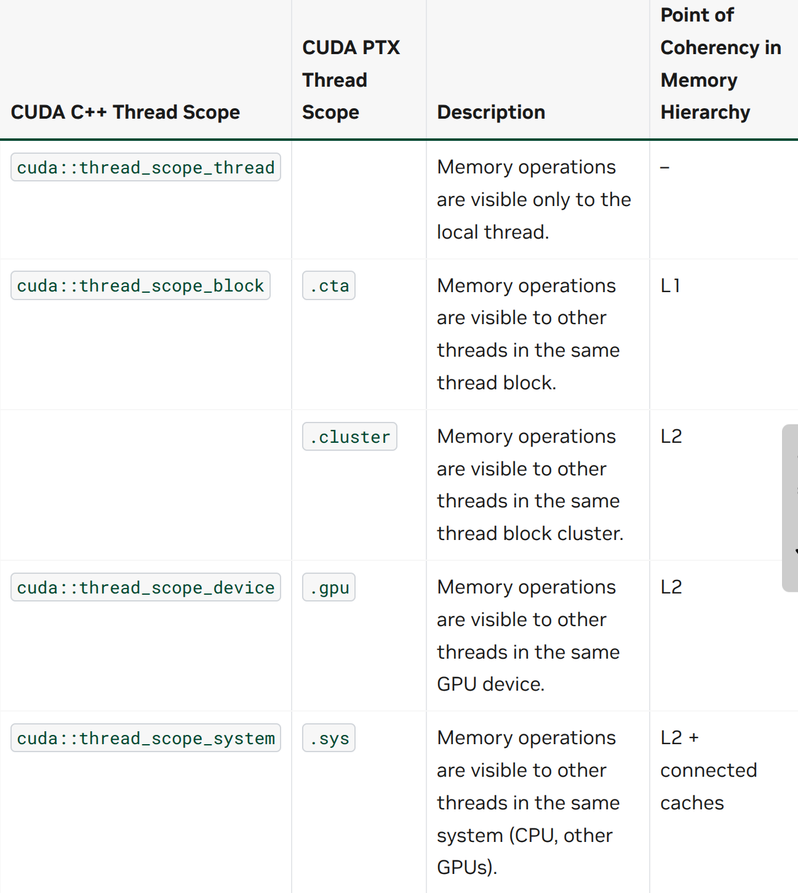
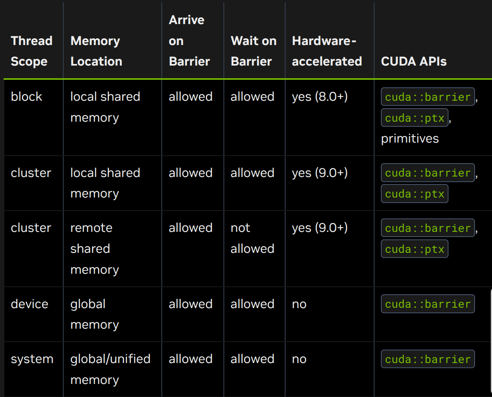
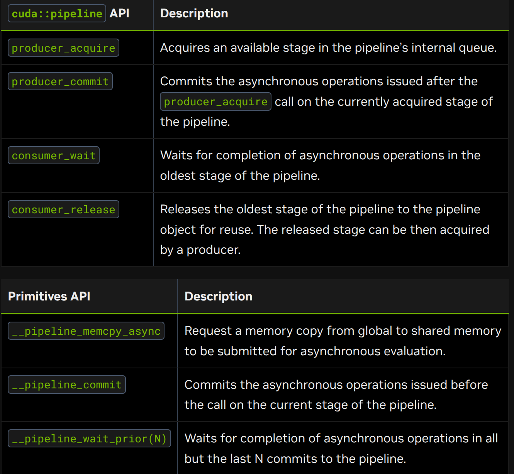
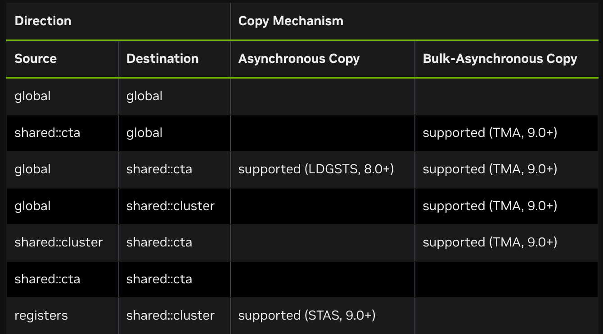

# 3.2 Advanced Kernel Programming

## 3.2.1 Using PTX

*[PTX ISA document](https://docs.nvidia.com/cuda/parallel-thread-execution/index.html)*

*[cuda::ptx namespace](https://nvidia.github.io/cccl/unstable/libcudacxx/ptx_api.html)*

***[inline ptx](https://docs.nvidia.com/cuda/inline-ptx-assembly/index.html)***

## 3.2.2 Hardware Implementation

>The NVIDIA GPU architecture uses a little-endian representation.

### 3.2.2.1 SIMT Execution Model

Each SM creates, manages, schedules, and executes threads in groups of 32 parallel threads called warps. Individual threads composing a warp start together at the same program address, but they have their own instruction address counter and register state and are therefore free to branch and execute independently. 
A warp executes one common instruction at a time, so full efficiency is realized when all 32 threads of a warp agree on their execution path. If threads of a warp diverge via a data-dependent conditional branch, the warp executes each branch path taken, disabling threads that are not on that path. **Branch divergence occurs only within a warp; different warps execute independently regardless of whether they are executing common or disjoint code paths.**

>The SIMT architecture is akin to SIMD (Single Instruction, Multiple Data) vector organizations in that a single instruction controls multiple processing elements. A key difference is that SIMD vector organizations expose the SIMD width to the software, whereas SIMT instructions specify the execution and branching behavior of a single thread. In contrast with SIMD vector machines, SIMT enables programmers to write thread-level parallel code for independent, scalar threads, as well as data-parallel code for coordinated threads. For the purposes of correctness, the programmer can essentially ignore the SIMT behavior; however, substantial performance improvements can be realized by taking care that the code seldom requires threads in a warp to diverge. In practice, this is analogous to the role of cache lines: the cache line size can be safely ignored when designing for correctness but must be considered in the code structure when designing for peak performance. Vector architectures, on the other hand, require the software to coalesce loads into vectors and manage divergence manually.

#### 3.2.2.1.1. Independent Thread Scheduling

>On GPUs with compute capability lower than 7.0, warps used a single program counter shared amongst all 32 threads in the warp together with an active mask specifying the active threads of the warp. As a result, threads from the same warp in divergent regions or different states of execution cannot signal each other or exchange data, and algorithms requiring fine-grained sharing of data guarded by locks or mutexes can lead to deadlock, depending on which warp the contending threads come from.

In GPUs of compute capability 7.0 and later, independent thread scheduling allows full concurrency between threads, regardless of warp. With independent thread scheduling, the GPU maintains execution state per thread, including a program counter and call stack, and can yield execution at a per-thread granularity, either to make better use of execution resources or to allow one thread to wait for data to be produced by another. A schedule optimizer determines how to group active threads from the same warp together into SIMT units. This retains the high throughput of SIMT execution as in prior NVIDIA GPUs, but with much more flexibility: threads can now diverge and reconverge at sub-warp granularity.

>The threads of a warp that are participating in the current instruction are called the active threads, whereas threads not on the current instruction are inactive (disabled). Threads can be inactive for a variety of reasons including having exited earlier than other threads of their warp, having taken a different branch path than the branch path currently executed by the warp, or being the last threads of a block whose number of threads is not a multiple of the warp size.
>If a non-atomic instruction executed by a warp writes to the same location in global or shared memory from more than one of the threads of the warp, the number of serialized writes that occur to that location may vary depending on the compute capability of the device. However, for all compute capabilities, which thread performs the final write is undefined.
>If an atomic instruction executed by a warp reads, modifies, and writes to the same location in global memory for more than one of the threads of the warp, each read/modify/write to that location occurs and they are all serialized, but the order in which they occur is undefined.

#### 3.2.2.2. Hardware Multithreading

>When an SM is given one or more thread blocks to execute, it partitions them into warps and each warp gets scheduled for execution by a warp scheduler. The way a block is partitioned into warps is always the same; each warp contains threads of consecutive, increasing thread IDs with the first warp containing thread 0. 

The execution context (program counters, registers, etc.) for each warp processed by an SM is maintained on-chip throughout the warp’s lifetime. **Therefore, switching between warps incurs no cost.** At each instruction issue cycle, a warp scheduler selects a warp with threads ready to execute its next instruction (the active threads of the warp) and issues the instruction to those threads.

>Each SM has a set of 32-bit registers that are partitioned among the warps, and a shared memory that is partitioned among the thread blocks. The number of blocks and warps that can reside and be processed concurrently on the SM for a given kernel depends on the amount of registers and shared memory used by the kernel, as well as the amount of registers and shared memory available on the SM. There are also a maximum number of resident blocks and warps per SM. These limits, as well the amount of registers and shared memory available on the SM, depend on the compute capability of the device and are specified in Compute Capabilities. If there are not enough resources available per SM to process at least one block, the kernel will fail to launch. 

#### 3.2.2.3. Asynchronous Execution Features

##### 3.2.2.3.1. Async Thread and Async Proxy

>Asynchronous operations may access memory differently than regular operations. To distinguish between these different memory access methods, CUDA introduces the concepts of an async thread, a generic proxy, and an async proxy. Normal operations (loads and stores) go through the generic proxy. Some asynchronous instructions, such as LDGSTS and STAS/REDAS, are modeled using an async thread operating in the generic proxy. Other asynchronous instructions, such as bulk-asynchronous copies with TMA and some tensor core operations (tcgen05.*, wgmma.mma_async.*), are modeled using an async thread operating in the async proxy.

Async thread operating in generic proxy. When an asynchronous operation is initiated, it is associated with an async thread, which is different from the CUDA thread that initiated the operation. Preceding generic proxy (normal) loads and stores to the same address are guaranteed to be ordered before the asynchronous operation. However, subsequent normal loads and stores to the same address are not guaranteed to maintain their ordering, potentially incurring a race condition until the async thread completes.

Async thread operating in async proxy. When an asynchronous operation is initiated, it is associated with an async thread, which is different from the CUDA thread that initiated the operation. Prior and subsequent normal loads and stores to the same address are not guaranteed to maintain their ordering. A proxy fence is required to synchronize them across the different proxies to ensure proper memory ordering. 

## 3.2.3 Thread Scopes

**A thread scope defines which threads can observe a thread’s loads and stores and specifies which threads can synchronize with each other using synchronization primitives such as atomic operations and barriers. Each scope has an associated point of coherency in the memory hierarchy.**



## 3.2.4 Advanced Synchronization Primitives

- Scoped Atomics.
- Asynchronous Barriers.
- Pipelines.

### 3.2.4.1. Scoped Atomics

Scoped atomics provide the tools for efficient synchronization at the appropriate level of the CUDA thread hierarchy, enabling both correctness and performance in complex parallel algorithms.

#### 3.2.4.1.1. Thread Scope and Memory Ordering

- Thread Scope: defines which thread can observe the effect of the atomic operation.
- Memory Ordering: defines the ordering constraints relative to other memory operations (see [C++ standard atomic memory semantics](https://zh.cppreference.com/cpp/atomic/memory_order)) (see [memory_order](../C++/memory_order.md))

```C++
#include <cuda/atomic>

__global__ void block_scoped_counter() {
    __shared__ cuda::atomic<int, cuda::thread_scope_block> counter;

    if (threadIdx.x == 0) {
        counter.store(0, cuda::memory_order_relaxed);
    }
    __syncthreads();

    int old_value = counter.fetch_add(1, cuda::memory_order_relaxed);
}
```

`cuda::memory_order_relaxed` is chosen here because we only need atomicity (indivisible read-modify-write) without ordering constraints between different memory locations. Since this is a straightforward counting operation, the order of increments doesn’t matter for correctness.

```C++
__global__ void producer_consumer() {
    __shared__ int data;
    __shared__ cuda::atomic<bool, cuda::thread_scope_block> ready;

    if (threadIdx.x == 0) {
        // producer
        data = 42;
        // // Release ensures data write is visible
        ready.store(true, cuda::memory_order_release);
    } else {
        // consumer
        // // Acquire ensures data read sees the write
        while (!ready.load(cuda::memory_order_acquire)) {
            // spin
        }
        int value = data;
        //
    }
}
```

#### 3.2.4.1.2. Performance Considerations

- Use the narrowest scope possible: block-scoped atomics are much faster than system-scoped atomics.
- **Prefer weaker ordering: use stronger orderings only when necessary for correctness.**
- Consider memory location: shared memory atomics are faster than global memory atomics.

### 3.2.4.2 Asynchronous Barriers

An asynchronous barrier differs from a typical single-stage barrier (`__syncthreads()`) in that the notification by a thread that it has reached the barrier (the “arrival”) is separated from the operation of waiting for other threads to arrive at the barrier (the “wait”). **This separation increases execution efficiency by allowing a thread to perform additional operations unrelated to the barrier, making more efficient use of the wait time.** 

>Asynchronous barriers are available on devices of compute capability 7.0 or higher. Devices of compute capability 8.0 or higher provide hardware acceleration for asynchronous barriers in shared-memory and a significant advancement in synchronization granularity, by allowing hardware-accelerated synchronization of any subset of CUDA threads within the block. 



```C++
#include <cuda/barrier>
#include <cooperative_groups.h>

__device__ void compute(float *data, int iteration);

__global__ void split_arrive_wait(int iteration_count, float *data) {
    using barrier_t = cuda::barrier<cuda::thread_scope_block>;
    __shhared__ barrier_t bar;
    auto block = cooperative_groups::this_thread_block();

    if (block.thread_rank() == 0) {
        init(&bar, block.size());
    }
    block.sync();

    for (int i = 0; i < iteration_count; ++i) {
        // code

        // This thread arrive. Arrival does not block a thread
        barrier_t::arrival_token token = bar.arrive();

        compute(data, i);

        // // Wait for all threads participating in the barrier to complete bar.arrive().
        bar.wait(std::move(token));

        // code
    }
}
```

The synchronization point is split into an arrive point (`bar.arrive()`) and a wait point (`bar.wait(std::move(token))`).
A thread begins participating in a `cuda::barrier` with its first call to `bar.arrive()`. When a thread calls `bar.wait(std::move(token))` it will be blocked until participating threads have completed `bar.arrive()` the expected number of times, which is the expected arrival count argument passed to `init()`. 
**Memory updates that happen before participating threads’ call to `bar.arrive()` are guaranteed to be visible to participating threads after their call to `bar.wait(std::move(token))`. Note that the call to `bar.arrive()` does not block a thread, it can proceed with other work that does not depend upon memory updates that happen before other participating threads’ call to `bar.arrive()`.**

The arrive and wait pattern has five stages:

- Code before the arrive performs memory updates that will be read after the wait.
- Arrive point with implicit memory fence (i.e., equivalent to `cuda::atomic_thread_fence(cuda::memory_order_seq_cst, cuda::thread_scope_block)`).
- Code between arrive and wait.
- Wait point.
- Code after the wait, with visibility of updates that were performed before the arrive.

### 3.2.4.3 Pipelines

>The CUDA programming model provides the pipeline synchronization object as a coordination mechanism to sequence asynchronous memory copies into multiple stages, facilitating the implementation of double- or multi-buffering producer-consumer patterns. 

**A pipeline is a double-ended queue with a head and a tail that processes work in a first-in first-out (FIFO) order. Producer threads commit work to the pipeline’s head, while consumer threads pull work from the pipeline’s tail.**



see [Pipelines]()

## 3.2.5 Asynchronous Data Copies

>Efficient data movement within the memory hierarchy is fundamental to achieving high performance in GPU computing. Traditional synchronous memory operations force threads to wait idle during data transfers. GPUs inherently hide memory latency through parallelism. That is, the SM switches to execute another warp while memory operations complete. Even with this latency hiding through parallelism, it is still possible for memory latency to be a bottleneck on both memory bandwidth utilization and compute resource efficiency. 

Asynchronous data copies enable overlapping of computation with data movement, **by decoupling the initiation of a memory transfer from waiting for its completion.** This way, threads can perform useful work during memory latency periods, leading to improved overall throughput and resource utilization.

CUDA applications often employ a copy and compute pattern that:
    fetches data from global memory,
    stores data to shared memory, and
    performs computations on shared memory data, and potentially writes results back to global memory.
The copy phase of this pattern is typically expressed as `shared[local_idx] = global[global_idx]`. This global to shared memory copy is expanded by the compiler to a read from global memory into a register followed by a write to shared memory from the register.
Each thread block needs to synchronize after the `shared[local_idx] = global[global_idx]` assignment, to ensure all writes to shared memory have completed before the compute phase can begin. The thread block also needs to synchronize again after the compute phase, to prevent overwriting shared memory before all threads have completed their computations. 

With asynchronous data copies, data movement from global memory to shared memory can be done asynchronously to enable more efficient use of the SM while waiting for data to arrive.

```C++
#include <cooperative_groups.h>
#include <cooperativve_groups/memcpy_async.h>

__device__ void compute(int *global_out, int const *shared_in) {
    //
}

__global__ void with_async_copy(int* global_out, int const* global_in, size_t size, size_t batch_sz) {
    auto grid = cooperative_groups::this_grid();
    auto block = cooperative_groups::this_thread_block();
    assert(size == batch_sz*grid_size());

    extern __shared__ int shared[]; // block.size()
    size_t local_idx = block.thread_rank();

    for (size_t batch = 0; batch < batch_sz; ++batch) {
        size_t block_batch_idx = block.group_index().x * block.size() + grid.size() * batch;
        /*
        size_t global_idx = block_batch_idx + threadIdx.x;
        shared[local_idx] = global_in[global_idx];
        block.sync();
        */

        // // Whole thread-group cooperatively copies whole batch to shared memory.
        cooperative_groups::memcpy_async(block, shared, global_in + block_batch_idx, block.size());

        // compute on different data while waiting

        // wait for all copies to complete
        cooperative_groups::wait(block);

        compute(global_out + block_batch_idx, shared);

        block.sync();
    }
}
```

The `cooperative_groups::memcpy_async` function copies `block.size()` elements from global memory to the shared data. **This operation happens as-if performed by another thread, which synchronizes with the current thread’s call to `cooperative_groups::wait` after the copy has completed.** **Until the copy operation completes, modifying the global data or reading or writing the shared data introduces a data race.**This example illustrates the fundamental concept behind all asynchronous copy operations: they decouple memory transfer initiation from completion, allowing threads to perform other work while data moves in the background. 



## 3.2.6 Configuring L1/Shared Memory Balance

The L1 and shared memory on an SM use the same physical resource, known as the unified data cache. 

An application can set the `carveout`, or preferred shared memory capacity, with the `cudaFuncSetAttribute` function called before the kernel is launched.The application can set the `carveout` as an integer percentage of the maximum supported shared memory capacity of that architecture. In addition to an integer percentage, three convenience enums are provided as carveout values. Where a chosen integer percentage carveout does not map exactly to a supported shared memory capacity, the next larger capacity is used. 

```C++
cudaSharedmemCarveoutDefault
cudaSharedmemCarveoutMaxL1
cudaSharedmemCarveoutMaxShared

cudaFuncSetAttribute(kernel_name, cudaFuncAttributePreferredSharedMemoryCarveout, carveout);
```
see [Shared Memory Capacity per Compute Capability ](https://docs.nvidia.com/cuda/cuda-programming-guide/05-appendices/compute-capabilities.html#compute-capabilities-table-shared-memory-capacity-per-compute-capability)


