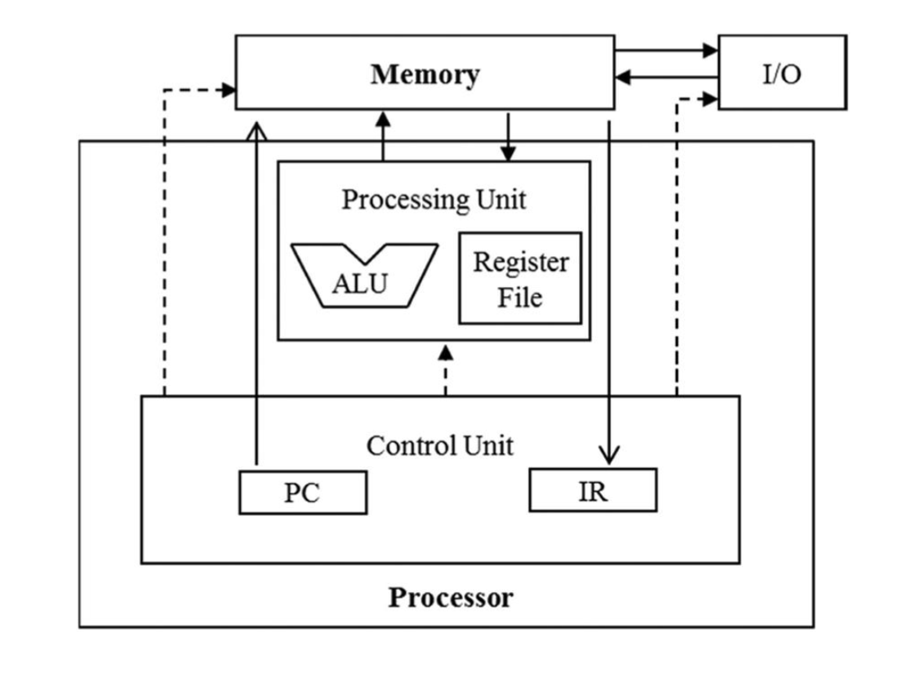
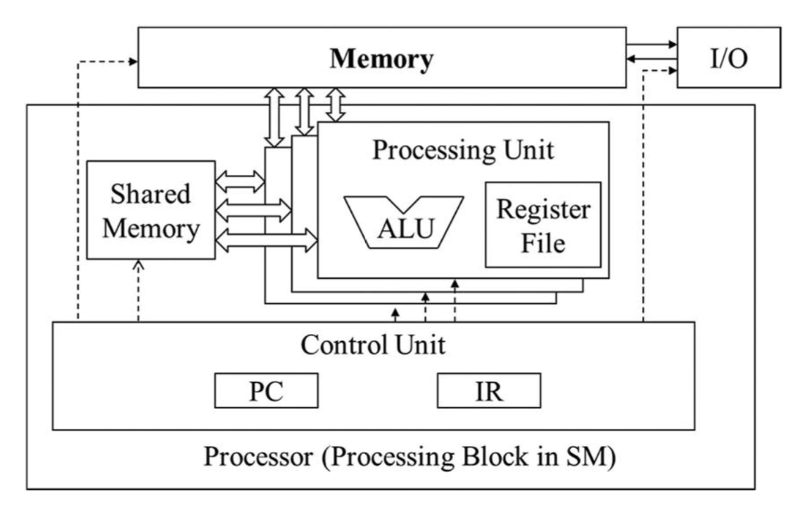
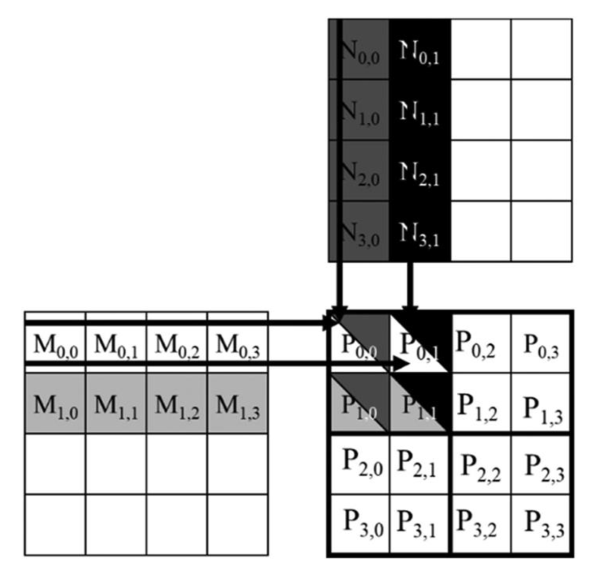
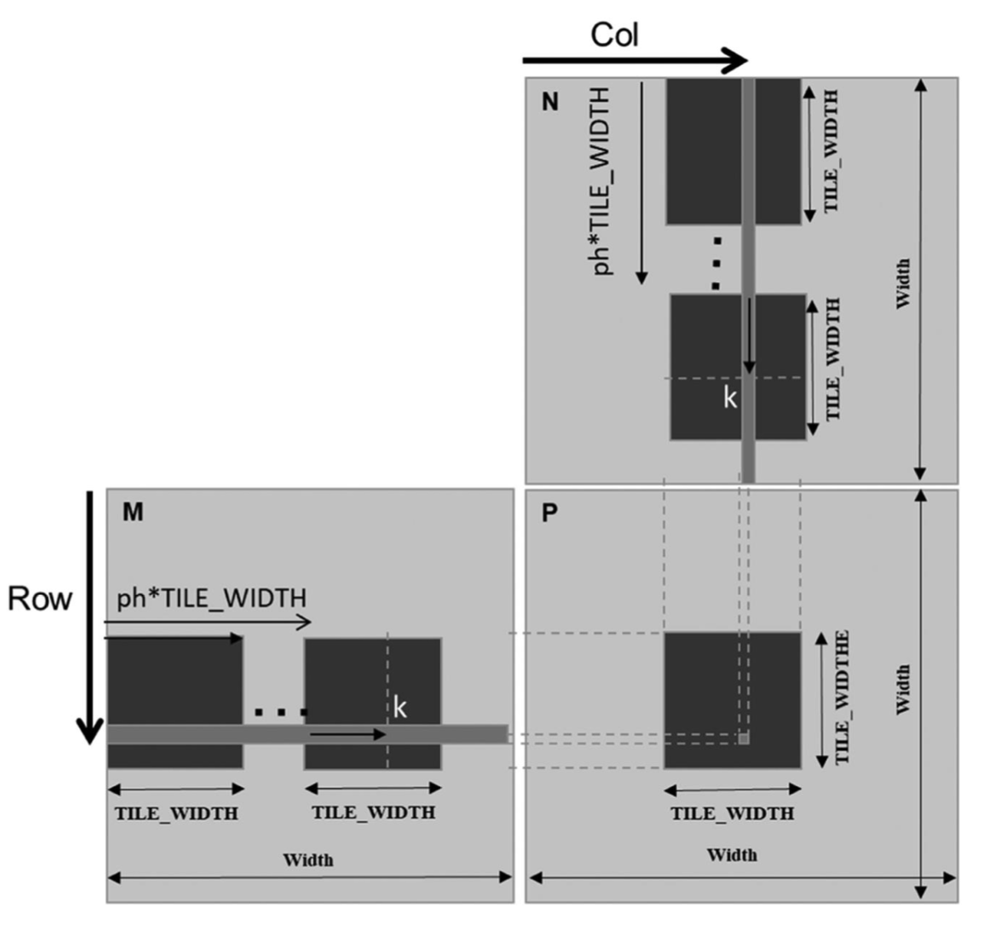

# Chapter 5 Memory Architecture and data locality

## 5.1 Importance of memory access efficiency

```C++
for (int k = 0; k < width; ++k)
    Pvalue += M[row*width+k] * N[k*width+col];
```

在朴素的矩阵乘法实现核函数中，最核心的就是上述for循环计算矩阵M某行与矩阵N某列的点乘。在这个循环中，通常会产生两次 global memory 访问，并执行一次浮点乘法和一次浮点加法。因此浮点操作与全局内存访问的比例为 `2FLOP to 8B(0.25FLOP/B)`，`defined as the nnumber of FLOPs performed for each bytes access from global memory within a region of a program`,这个比率通常也被称为算术强度(arithmetic intensity)或计算强度(computational intensity)。

算术强度是一个CUDA kernel的性能的主要因素之一。比如 A100 GPU 的峰值全局内存带宽是 1555GB/s，那么这个kernel的浮点运算性能最多 389GFLOPs。但是这仅仅只有 A100 单精度浮点运算峰值吞吐量的2%（峰值19500 GFLOPs，tenser core 156000 GFLOPs）。所以这个矩阵乘法kernel严重被全局内存访问带宽所限制（memory-bound）。

## 5.2 CUDA memory types

[](../CUDA%20Programming%20Guide/2.2.4.%20Memory-Performance.md)
[](../CUDA%20Programming%20Guide/2.2CUDA-SIMT-Kernels.md)





## 5.3 Tiling for reduced memory traffic




```C++
#define TILED_WIDTH 16
__global__ void tiled_mm(float* a, float* b, float* c, size_t width) {
    __shared__ float float smema[TILED_WIDTH][TILED_WIDTH];
    __shared__ float float smemb[TILED_WIDTH][TILED_WIDTH];

    int row = blockIdx.y*TILED_WIDTH + threadIdx.y;
    int col = blockIdx.x*TILED_WIDTH + threadIdx.x;

    float val = 0.0;

    for (int p = 0; p < width/TILED_WIDTH; ++p) {
        smema[threadIdx.y][threadIdx.x] = a[row*width+p*TILED_WIDTH+threadIdx.x];
        smemb[threadIdx.y][threadIdx.x] = b[(p*TILED_WIDTH + threadIdx.y)*width + col];
        __syncthreads();

        for (int k = 0; k < TILED_WIDTH ; ++k)
            val += smema[threadId.y][k] * smemb[k][threadIdx.x]; 

        __syncthreads();
    }
    c[row*width+col] = val;
}

tiled_mm<<<(),(TILED_WIDTH,TILED_WIDTH)>>>(...);
```

分析朴素矩阵与分块矩阵乘法（同样是一个线程计算一个结果）的全局内存访问：
1. 朴素方法。对于结果矩阵的每一行计算，thread0~width-1 都要重复读取矩阵a的同一行，计算的全局内存访问次数是 2 * width * width * width 
2. 分块方法。for循环将分块计算分成width/TILED_WIDTH个阶段，所以数据的，计算的全局内存访问次数是重复读取次数就是阶段数 2 * width * width * width/TILED_WIDTH
所以上面分块矩阵乘法的实现将全局内存访问减少了TILED_WIDTH倍。假设16x16 tile，意味着如果是在A100上实现峰值吞吐量可以达到 6220 GFLOPs，但仍然只有32%。

## 5.5 Boundary checks

```C++
jxk * kxl
for (int p = 0; p < ceil(Width/(float)TILED_WIDTH); ++p) {
    if (row < j && (p*TILED_WIDTH+threadIdx.x) < k)
        smem[threadIdx.y][threadIdx.x] = a[row*k+p*TILED_WIDTH+threadIdx.x];
    else
        smema[threadIdx.y][threadIdx.x] = 0.0f;
    if ((p*TILED_WIDTH + threadIdx.y) < k && col < l)
        smemb[threadIdx.y][threadIdx.x] = b[(p*TILED_WIDTH + threadIdx.y)*l + col]
    else
        smemb[threadIdx.y][threadIdx.x] = 0.0f;
    __syncthreads()

    for (int k = 0; k < TILED_WIDTH ; ++k)
            val += smema[threadId.y][k] * smemb[k][threadIdx.x]; 

    __syncthreads();
}
if (row < j && col < l)
    c[row*l + col] = val;
```

## 5.6 Impact of memory usage on occupancy

A100 164KB of shared memory per SM and a maximum of 2048 threads per SM
如果使线程占用率为100%，则一个线程块中的线程不能使用超过 164KB/2048threads = 82B/thread 的共享内存。在前面分块矩阵乘法中每个线程块要使用$TILED^2*4B*2$的共享内存，平均8B/thread，因此占用率不会受共享内存的大小所限制。
